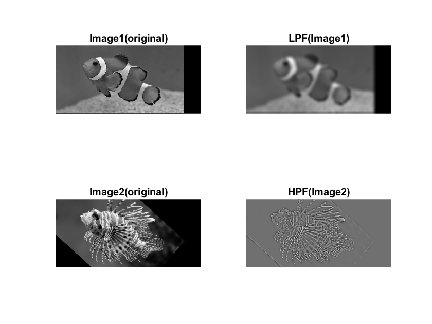
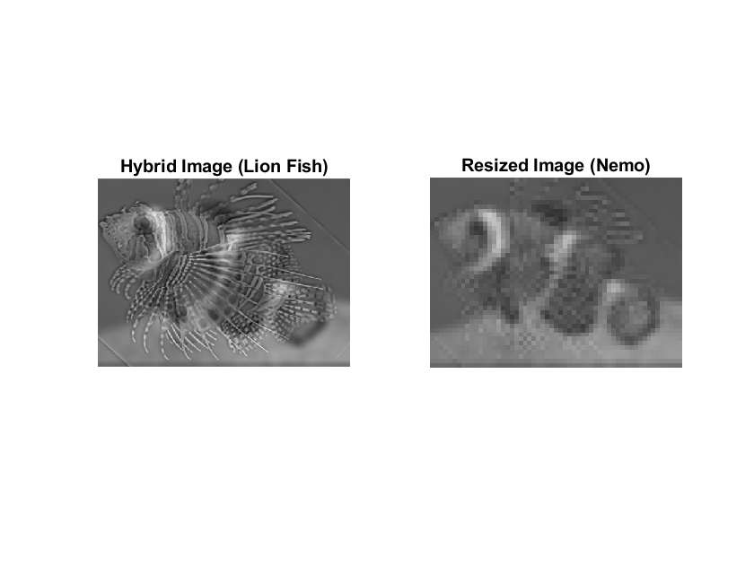
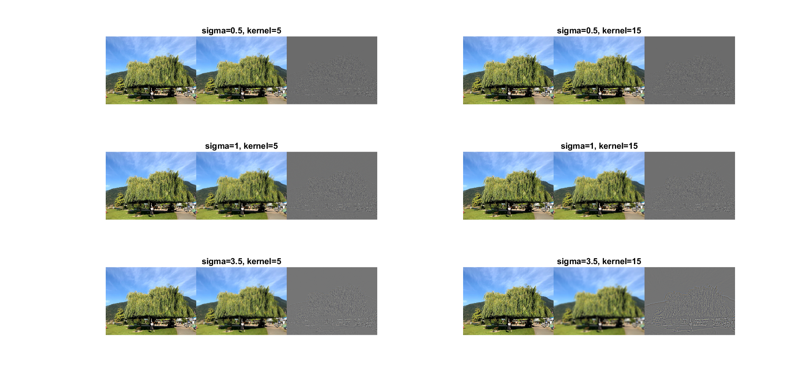
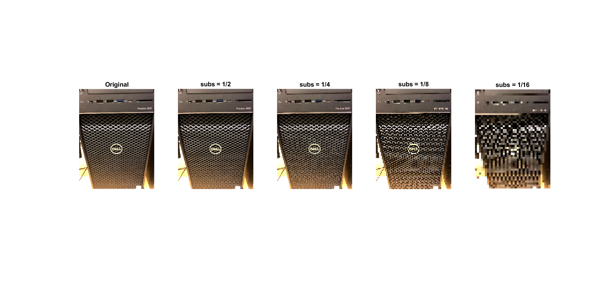
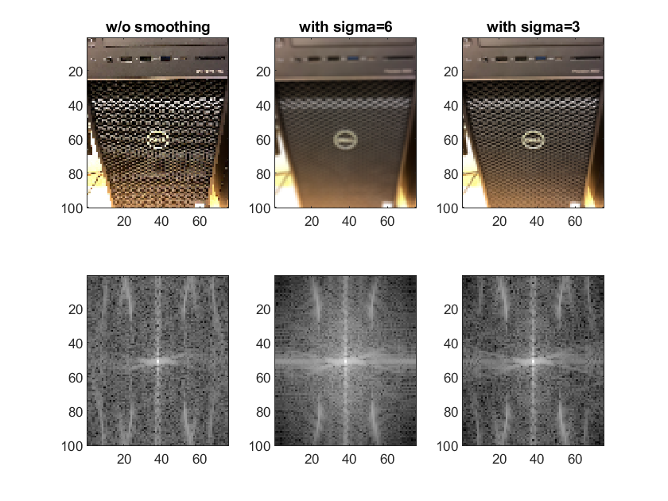
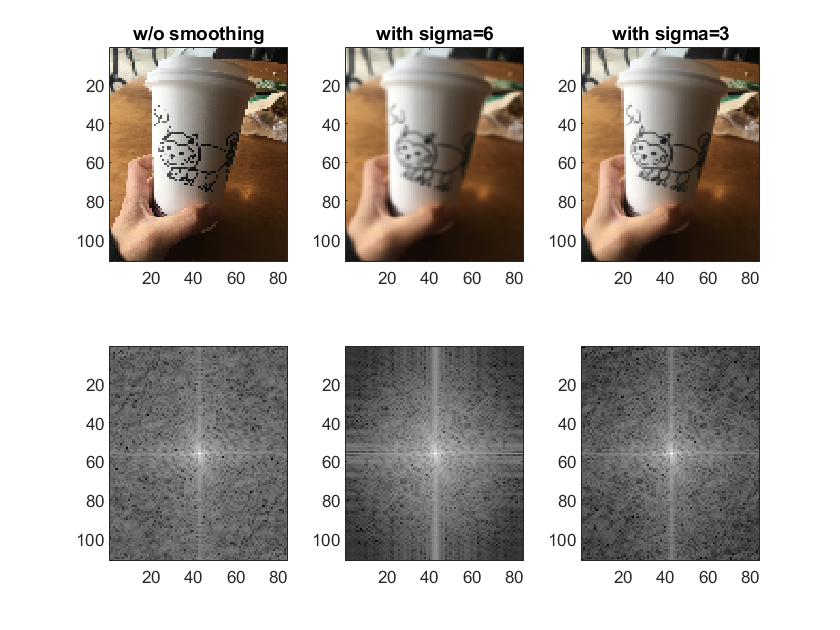
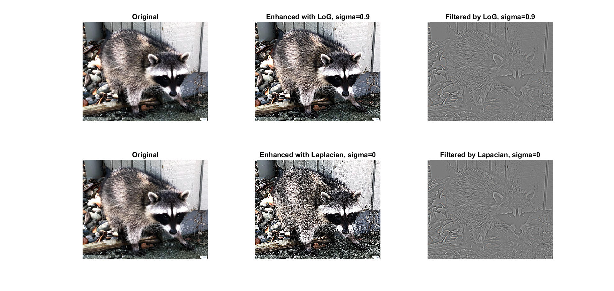
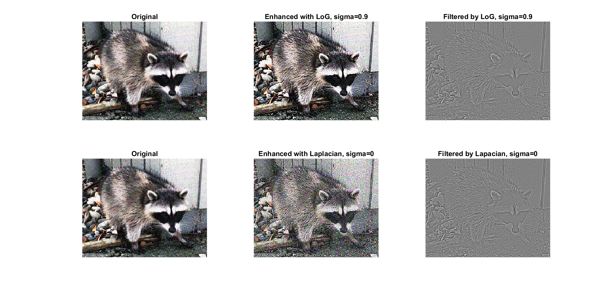

# Hybrid-Image
Implementation of the hybrid image that have different interpretations at different distances by blending the high frequency portion of one image with the low-frequency portion of another,

# Dependencies
* MATLAB
```
hybrid-image-starter
```
## Results



## Analysis
### Gaussian and Lapalcian filters
As the filter size getting bigger (from 5 to 15, left to right), the outputs of LPF showed more blurred. 
For the standard deviation is changed to get bigger, the results of HPF showed more edges.

Figure: From the left to right, {original, LPF, and HPF} per each experiment

### Image Subsampling and aliasing 
#### 1. Subsampling
If I subsample without smoothing, I can observe aliasing from the subsampling rate as 8.  


#### 2. Anti-aliasing
Compared to the image without smoothing, I can observe that the high-frequency area of the filtered image in the frequency domain is attenuated near sides, which results in preventing aliasing. For the filter with bigger sigma (big filter size), I can see that it makes the image more blurred unnecessarily, which means that we need to consider trade-offs between blurring and anti-aliasing when choosing the low pass filter.



#### 3. Laplacian of Gaussian and Image Enhancement
Since the output of the LoG filter has meaningful edges, we can add them to the original image to enhance it. As you can see from the below, the filtered images showed sharp edges.

To compare Laplacian of Gaussian filtering with Laplacian-only one, I added some noises to the original image, and see the differences. The below results show that the Laplacian filter is more sensitive to noise than the LoG filter.


## Author

Suhong Kim – [@github](https://github.com/suhongkim) – suhongkim11@gmail.com \
Distributed under the MIT license. See the [LICENSE.md](LICENSE.md) file for details


## Inspiration
This project is a part of [the CMPT985 assignments](http://yaksoy.github.io/cpim/p1/) at SFU. 
